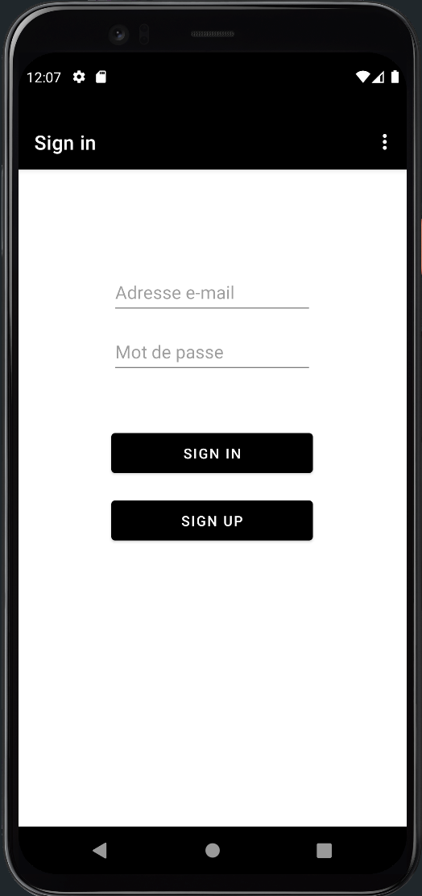

# picts Manager

## Description

picts Manager is an Android application that allows users to capture and store photos in their account's gallery. Users can sign up or sign in with their email address and password to start using the app. With the built-in camera feature, users can take photos and save them to their gallery for easy access and organization. The app also provides sharing functionality, allowing users to share their favorite photos with friends and family.

##  Stack

picts Manager is built using:

- **Kotlin**: Kotlin is a modern supported for Android app development by Google.

- **Firebase**: Firebase is a mobile platform provided by Google that offers a suite of cloud-based tools and services for building mobile apps.

## Features

- **User authentication**: Sign up or sign in with email and password.

 

- **Camera integration**: Capture photos using the app's built-in camera.

- **Gallery management**: Store and organize photos in the user's gallery.

- **Sharing functionality and delete**: Share photos with others directly from the app or delete it directly.

- **Shared contents**: album with all the content received and who send it.

 

## Getting Started

To run the picts Manager locally on your machine, follow the instructions below.

### Prerequisites

Make sure you have the following software installed:

- Docker
- Docker Compose

### Launching the Containers with Docker Compose

1. Clone the repository to your local machine.

2. Navigate to the root of the project in the terminal.

3. Build the containers using Docker Compose.

docker compose build

5. Launch the containers.

docker compose up

