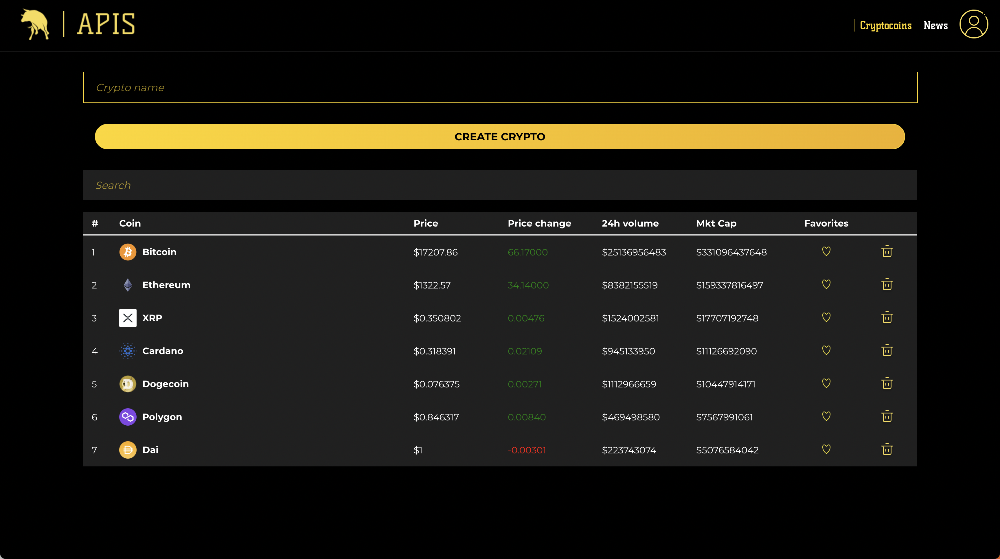
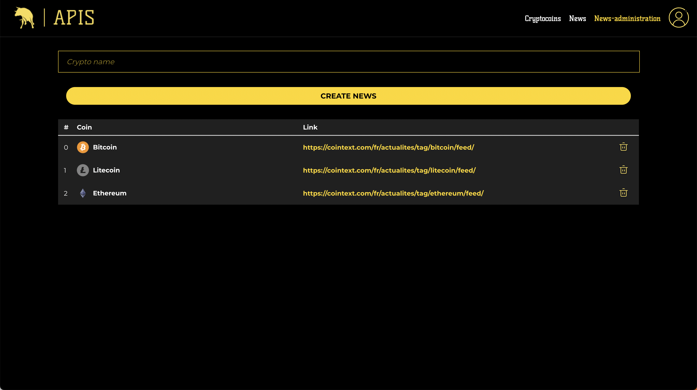
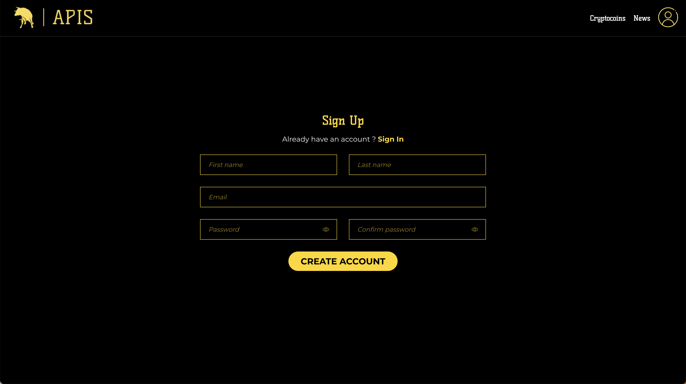
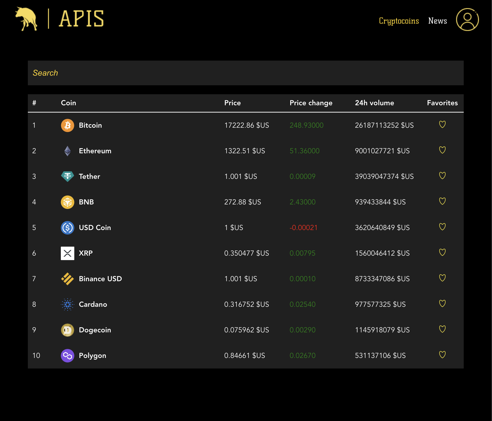
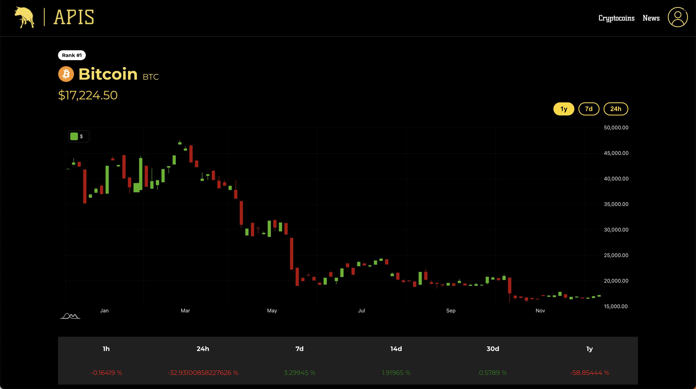
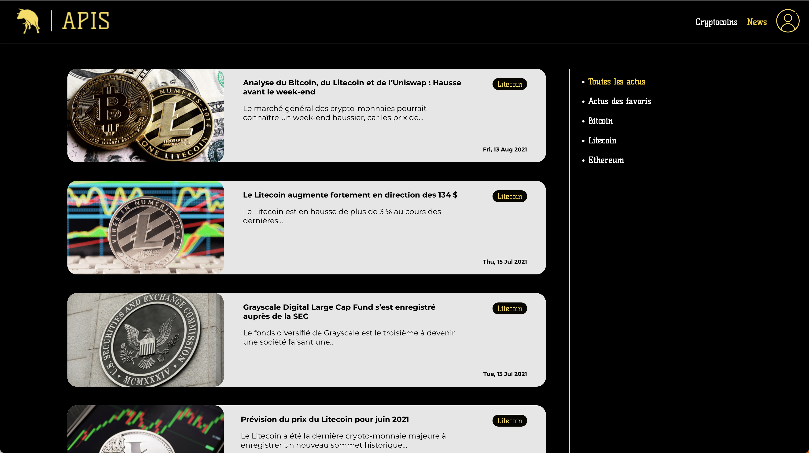

# What is Apis?

**Apis** is a cryptocurrency management application

This repository contains the code for a web app that allows :

* **Administrators** to manage the various cryptocurrencies that users can access information about, 

* they can also Manage article about cryptocurrency

* **Users** to create an account,  

* add their favorite cryptocurrencies, 

* see the evolution of the market, 

* and read articles related to their favorite coins.

 

The app is built with a **Vue.js** frontend, an **Elixir/Phoenix** backend, and a **Postgres** database. It is launched using Docker.

# Launching the Containers with Docker Compose

In order to launch all three of the containers for this application (the frontend, backend, and database), we will use `docker-compose`.

## Prerequisites

Before getting started, make sure you have the following installed on your machine:

- Docker
- Docker Compose

## Launch the Containers

use `docker-compose` to launch the three containers. Run the following commands from the root of the project:

`docker compose build` 

`docker-compose up`

This will build then launch the frontend, backend, and database containers, and connect them to each other as necessary. The application should now be up and running!

## Stopping the Containers

To stop the containers, simply press `CTRL + C` in the terminal window where the containers are running.

